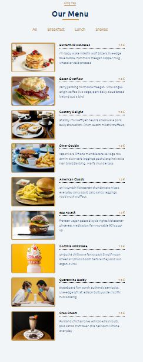

# Our_Menu

## Merhaba! 👋
https://react-projects-5-menu.netlify.app/ adresindeki çalışmayı react ile bende kodlamak istedim.Elime bir tasarım geldiğinde bunu koda dökebildiğimi gördüm ve beni oldukça geliştiren bir süreç yaşadım.İlk defa Scss kullanmaya başladığım bu projede bir göstermelik login işlemi koydum ve tıklandığında yetkili kişinin fiyat güncellemesi yapabileceği şekilde interaktiflik kazandırdım.Aynı şekilde yetkili girişinde ürün silme işleminide ekledim.Responsive olarak kodlama yapma pretiği elde etmiş oldum.

Demo_Link: https://srcnllc.github.io/Our_Menu/

Site kodlarken;  

-React.js  
-Props kullanımı   
-React Icons 
-react-responsive içerisinden useMediaQuery hook

kullanılmıştır.  
  
